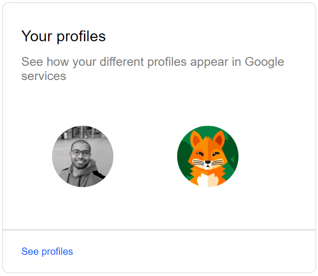

# Assignment 01
## HTML
```
<div class="out-box1">
        <h1 class="box1-h1">Business Development</h1>
        <p class="box1-p">Have an idea or inquiry for Waze business development?</p>
        <button class="box1-btn">Share your ideas</button>
</div>
```
## CSS
```
.out-box1{
    background-color: #1ce99c;
    margin: 100px auto;
    width:450px;
    padding:125px 55px;
    font-family: sans-serif;
    border-radius: 10px;
}
.box1-h1{
    width: 100px;
    font-size: 45px;
    margin-bottom: 20px;
}
.box1-p{
    font-size: 15px;
    margin-bottom: 25px;
    font-weight: 600;
}
.box1-btn{
    padding: 15px 40px;
    background-color: white;
    color: black;
    border: none;
    border-radius: 30px;
    font-size: 18px;
    margin-bottom: 20px;
    font-weight: 600;
}
```
## OUTPUT


## HTML
```
<div class="out-box2">
        <p class="box2-p1">Your profiles</p>
        <p class="box2-p2">See how your different profiles appear in Google services</p>
        
        
    </div>
    <div class="out-box2-dwn">
        <p class="out-box2-dwn-p">See profiles</p>
    </div>
```
## CSS
```
.out-box2{
    border: 1px solid lightgray;
    margin: 0px auto;
    width:450px;
    padding:15px 30px;
    font-family: sans-serif;
    border-top-left-radius: 10px;
    border-top-right-radius: 10px;
}
.out-box2-dwn{
    border: 1px solid lightgray;
    margin: 0px auto;
    width:450px;
    padding:15px 30px;
    font-family: sans-serif;
    border-bottom-left-radius: 10px;
    border-bottom-right-radius: 10px;
    margin-bottom: 100px;
}
.box2-p1{
    font-size: 25px;
    margin-bottom: 15px;
}
.box2-p2{
    font-size: 20px;
    color: gray;
    margin-top: 0;
}
.profile-1{
    width: 100px;
    border-radius: 50%;
    margin: 50px;
}
.out-box2-dwn-p{
    margin: 10px 0 ;
    color: rgb(0, 98, 255);
}
```
## OUTPUT


## HTML
```
<div class="out-box3">
        
        <div class="in-box3">
            <!---->
            <p class="box3-p1">SUBSCRIBE TO ANY PLAN</p>
            <p class="box3-p2">Get more features in Google Photos</p>
            <p class="box3-p3">Bring your favorite moments to life with more Google Photos editing tools for Android and iOS, including Magic Eraser. Subject to eligibility.</p>
            <button class="box3-btn">View details</button>
        </div>
</div>
```
## CSS
```
.out-box3{
    border: 1px solid lightgray;
    margin: 0px auto;
    width:500px;
    font-family: sans-serif;
    border-radius: 10px;
    margin-bottom: 100px;
}
.box3-img{
    width: 100%;
    border-top-left-radius: 10px;
    border-top-right-radius: 10px;
}
.in-box3{
    padding: 25px;
}
.img-box3{
    width: 15px;
}
.box3-p1{
    color: gray;
}
.box3-p2{
    font-size: 30px;
    margin: 0;
}
.box3-p3{
    font-size: 23px;
    color: gray;
}
.box3-btn{
    padding: 10px 30px;
    font-size: 20px;
    color: rgb(0, 98, 255);
    background-color: white;
    border: 1px solid gray;
    border-radius: 5px;
    margin: 10px 0;
}
```
## OUTPUT


## HTML
```
<div class="out-box4">
        
        <p class="box4-p">Welcome back!</p>
        <input type="text" placeholder="Enter your email">
        <input type="text" placeholder="Enter your password">
        <button class="btn-box4">Log in to Flodesk</button>
        <p class="box4-p1">Not a member? Sign up Forgot your password?</p>
        <p class="box4-p2">By continuing, you agree to Flodesk's terms and acknowledge you've read our privacy policy</p>
</div>
```
## CSS
```
.out-box4{
    margin:0 auto;
    width: 300px;
    /* background-color: aqua; */
    padding: 10px;
}
.img-box4{
    width: 200px;
    margin: 10px 20%;
}
input{
    width: 100%;
    padding: 15px 20px;
    box-sizing: border-box;
    border-radius: 5px;
    border: 1px solid lightgray;
    margin-bottom: 15px;
}
.box4-p{
    font-family: sans-serif;
    text-align: center;
}
.btn-box4{
    border: none;
    color: white;
    background-color: black;
    padding: 15px 35px;
    border-radius: 25px;
    margin: 1px 20%;  
}
.box4-p1{
    width: 170px;
    font-family: sans-serif;
    font-size: 15px;
    margin: 50px 20%;
    text-align: center;
    color: gray;
}
.box4-p2{
    margin: 0;
    color: gray;
    font-size: 15px;
    text-align: center;
}
```
## OUTPUT
