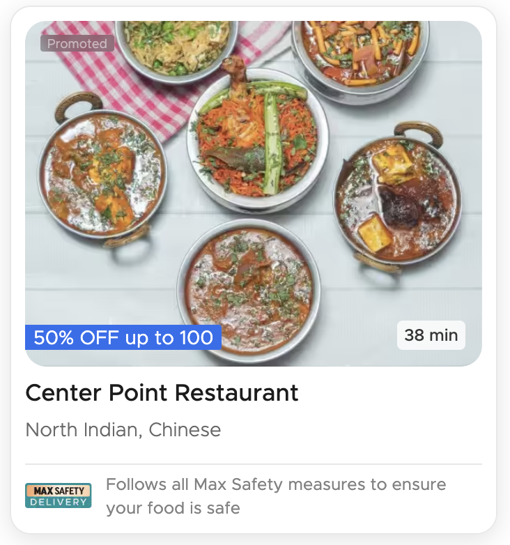
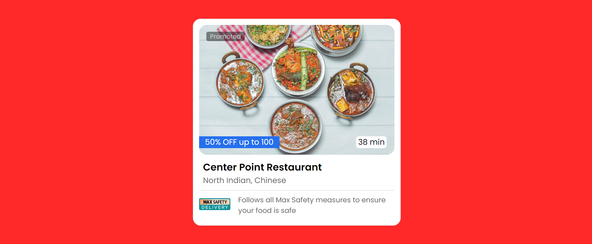
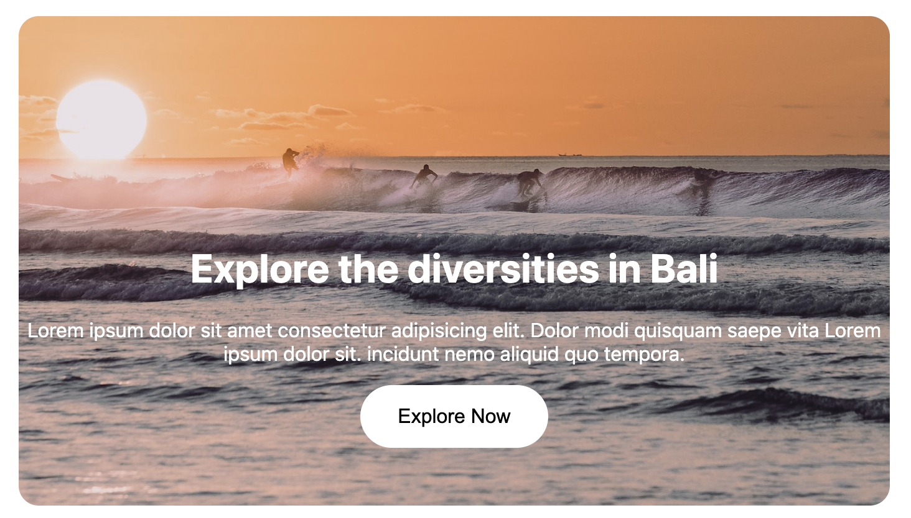
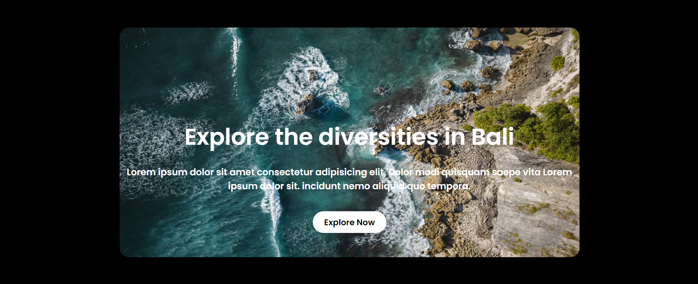
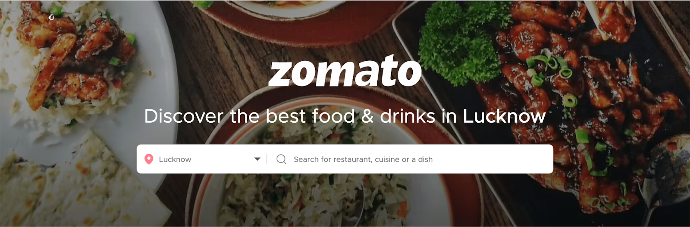
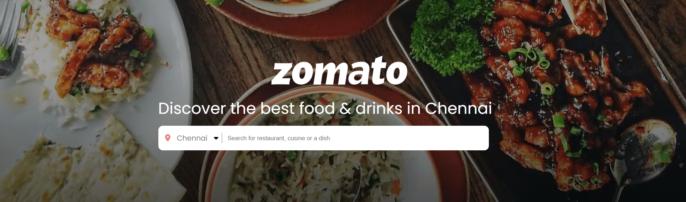
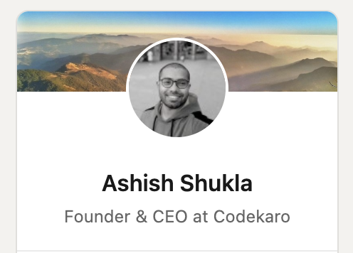

# Assignment 02
### ORIGINAL IMG

### CLONED IMG

### HTML
```
<div class="zom-card">
    <div class="img-con">
        
        <span class="promote">Promoted</span>
        <apan class="zom-off">50% OFF up to 100</apan>
        <apan class="zom-time">38 min</apan>
    </div>
    <div class="zom-content">
        <div class="zom-des">
            <p class="zom-p">Center Point Restaurant</p>
            <p class="zom-p-d">North Indian, Chinese</p>
        </div> 
    </div>
    <div class="zom-foot">
        
        <div class="zom-foot-p" >Follows all Max Safety measures to ensure your food is safe</div>
    </div> 
</div>
```
### CSS
```
.zom-card{
    border: 1px solid lightgray;
    width: 500px;
    padding: 15px;
    border-radius: 20px;
    margin: 50px auto;
    background-color: white;
}
.img-con{
    position: relative;
    width: 100%;
    cursor: pointer;
}
.zom-img{
    width: 100%;
    transform: scaleX(-1);
    border-radius: 20px;
}
.promote{
    font-family: "Poppins", sans-serif;
    padding: 0px 10px;
    margin: 18px;
    background-color: #00000073;
    color: #ffffff9c;
    position: absolute;
    left: 0;
    border-radius: 5px;
}
.zom-off{
    font-family: "Poppins", sans-serif;
    font-size: 20px;
    padding: 0px 15px;
    background-color: rgb(37, 111, 239);
    color: white;
    position: absolute;
    left: 0;
    bottom: 20px;
}
.zom-time{
    font-family: "Poppins", sans-serif;
    font-size: 20px;
    padding: 0px 5px;
    background-color: white;
    position: absolute;
    right: 20px;
    bottom: 20px;
    border-radius: 7px;
}
.zom-content{
    padding: 10px;
    border-bottom: 1px solid lightgray;
    cursor: pointer;
}
.zom-p{
    margin: 0;
    font-family: "Poppins", sans-serif;
    font-size: 25px;
    font-weight: 600;
}
.zom-p-d{
    margin: 0;
    font-family: "Poppins", sans-serif;
    color: rgb(105, 105, 105);
    font-size: 20px;
}
.zom-foot{
    margin: 20px 0;
    position: relative;
}
.zom-foot-img{
    width: 80px;
}
.zom-foot-p{
    font-family: "Poppins", sans-serif;
    color: rgb(105, 105, 105);
    font-size: 18px;
    width: 400px;
    position: absolute;
    top: -10px;
    right: 0px;
}
```
### ORIGINAL IMG

### CLONED IMG

### HTML
```
<div class="sun-bg">
    <div class="sun-card">
        
        <p class="sun-p" >Explore the diversities in Bali</p>
        <p class="sun-p-p" >Lorem ipsum dolor sit amet consectetur adipisicing elit. Dolor modi quisquam saepe vita Lorem ipsum dolor sit. incidunt nemo aliquid quo tempora.</p>
        <button class="sun-btn" >Explore Now</button>
    </div>
</div>
```
### CSS
```
.sun-bg{
    background-color: black;
    padding: 50px;
    margin: 50px 0;
    margin-bottom: 0;
}
.sun-card{
    width: 1000px;
    height: 500px;
    margin: 10px auto;
    position: relative;
    border-radius: 20px;
}
.sun-img{
    width: 100%;
    height: 100%;
    border-radius: 20px;
}
.sun-p{
    font-family:"Poppins", sans-serif;
    position: absolute;
    top: 150px;
    width: 100%;
    color: white;
    font-size: 50px;
    font-weight: 600;
    text-align: center;
}
.sun-p-p{
    font-family:"Poppins", sans-serif;
    position: absolute;
    margin-top: 50px;
    top: 250px;
    width: 100%;
    color: white;
    font-size: 20px;
    font-weight: 600;
    text-align: center;
}
.sun-btn{
    font-family:"Poppins", sans-serif;
    font-weight: 600;
    border: none;
    font-size: 18px;
    border-radius: 30px;
    padding: 10px 25px;
    background-color: white;
    color: black;
    position: absolute;
    top: 400px;
    left: 420px;
    cursor: pointer;
}
```
### ORIGINAL IMG

### CLONED IMG

### HTML
```
<div class="zom-head">
    
    
    <p class="zom-head-p" >Discover the best food & drinks in Chennai</p>
    <div class="zom-head-cont">
        <div class="zom-head-cont-wrap">
            <div class="zom-head-cont-wrap-lft">
                <i class="fa-solid fa-location-dot" style="color: #ec8383;"></i>
                <span class="loc">Chennai</span>
                <i class="fa-solid fa-caret-down"></i>
            </div>
            <input class="zom-head-search" placeholder="Search for restaurant, cusine or a dish"></input>
        </div>
    </div>
</div> 
```
### CSS
```
.zom-head{
    width: 100%;
    height: 450px;
    position: relative;
}
.zom-head-img{
    width: 100%;
    height: 100%;
    object-fit: cover;
}
.zom-head-logo{
    width: 300px;
    position: absolute;
    top: 125px; 
    left: 600px; 
}
.zom-head-p{
    font-family: "Poppins", sans-serif;
    font-size: 35px;
    color: white;
    position: absolute;
    top: 180px; 
    left: 350px; 
}
.zom-head-cont{
    padding: 15px;
    width: 700px;
    position: absolute;
    top: 280px; 
    left: 350px; 
    background-color: white;
    border-radius: 10px;
}
.zom-head-cont-wrap{
    position: relative;
}
.zom-head-cont-wrap-lft{
    width: 125px;
    border-right: 1px solid gray;
    cursor: pointer;
}
.loc{
    font-family: "Poppins", sans-serif;
    margin: 0 10px;
    color: gray;
}
.zom-head-search{
    position: absolute;
    right: 0;
    bottom: 2px;
    width: 80%;
    border: none;
}
.zom-head-cont-wrap-rgt{
    width: 100px;
}
```
### ORIGINAL IMG

### CLONED IMG

### HTML
```
<div class="link-bg">
    <div class="profile-card">
        <div class="profile-wrap">
            
            
        </div>
        <p class="profile-name">Ashish Shukla</p>
        <p class="profile-des">Founder & CEO at Codekaro</p>
    </div>
</div>
```
### CSS
```
.link-bg{
    background-color: #0077B5;
    padding: 50px;
    margin: 0;

}
.profile-card{
    margin: 0 auto;
    background-color: rgb(255, 255, 255);
    width: 400px;
    border-top-left-radius: 25px;
    border-top-right-radius: 25px;
    padding-bottom: 25px;
}
.profile-card-bg{
    width: 100%;
    border-top-left-radius: 25px;
    border-top-right-radius: 25px;
}
.profile-wrap{
    position: relative;
}
.profile-card-dp{
    position: absolute;
    border-radius: 50%;
    width: 125px;
    border: 5px solid white;
    left: 130px;
    bottom: -50px;    
    cursor: pointer;
}
.profile-name{
    font-family:"Poppins", sans-serif;
    font-size: 25px;
    font-weight: 600;
    margin-top: 75px;
    margin-bottom: 10px;
    text-align: center;
    cursor: pointer;
}
.profile-des{
    font-family:"Poppins", sans-serif;
    color: gray;
    text-align: center;
    margin-bottom: 50px;
    margin-top: 0;
    font-size: 20px;
}
```
